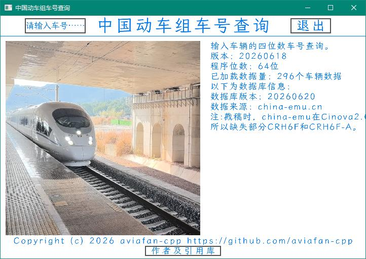
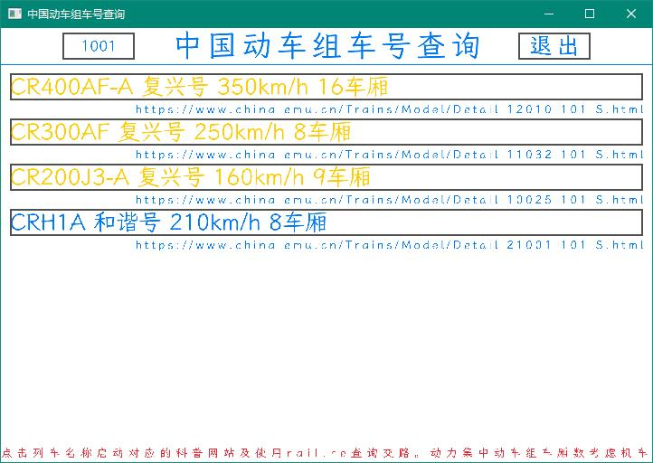

你是否遇到过，拍摄了一张中国动车组的车厢的照片，却难以从车厢号推测车型号的情况？

ChinaMUDecoder（China Multiple Unit Decoder，中国动车组车号查询）是一款基于C++/Raylib开发的**动车组车号查询软件**。  
软件可以通过**中国铁路动车组四位车号**反推回**中国铁路动车组型号**。  

Tip:请尽量不要将软件放在中文路径下 ~~（别怪我身上，这可能是Raylib导致的）~~。

使用与功能
---
此为**主菜单**  
  
此为**查询界面**  
  

您可以在任意界面编辑您输入的车号。  
Tips:  
1.对于文字过长导致无法在窗口内显示的情况，您可以横向拉长窗口以显示（我会尽快解决该问题）；  
2.当输入不满4位时按“回车”，软件会自动在前面补0至四位。

作者与信息
---
作者：一个飞友_cpp（aviafan-cpp）
[bilibili](https://space.bilibili.com/3546620213857006)
[Github](https://github.com/aviafan-cpp)  
字体：LXGW
[Github](https://github.com/lxgw/LxgwWenKai)  
图形库：Raylib
[官网](https://raylib.com)
[Github](https://github.com/raysan5/raylib)

软件版本：20260618
平台：Windows x64  
C++版本：C++17  
Raylib版本：5.5  
MinGW版本：15.1

数据库与编写
---
数据库版本：20260620  
数据来源：[ChinaEMU](https://china-emu.cn)  

暂不建议编写数据库，因为下一个版本可能重构数据库。

开发自己的版本？
---
请容许我向像您这样的开发者致敬，但恕我直言，这个软件的代码有亿些难懂。  
文件作用：  
ChinaMUDecoder.cpp 主文件  
raylib_obj_ex.cpp/.hpp 为Raylib提供的扩展 ~~（你为什么不用RayGUI……）~~  
sys_api.cpp/.hpp 系统API（目前只写了Windows）  
train_data.cpp/.hpp 数据库

如果您想将则软件打包进您的软件中，请遵守协议。  
本软件支持传入一个4位数的车号参数.

再次重申，请尽量不要将软件放在中文路径下 ~~（别怪我身上，这可能是Raylib导致的）~~。

移植？
---
如果您想要移植到Linux/MacOS上，请为sys_api.cpp编写对应的实现；  
如果您想要移植到安卓/iOS上，请在完成上一条提到内容的基础上给raylib_obj_ex.cpp的按钮逻辑进行修改以适配多点触控 ~~（或者不加）~~，并且最好增加一个屏幕键盘。